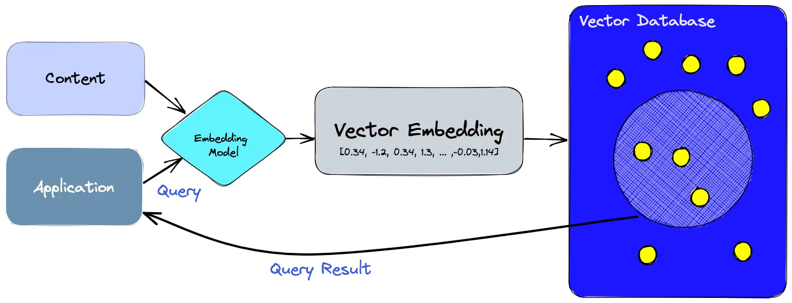
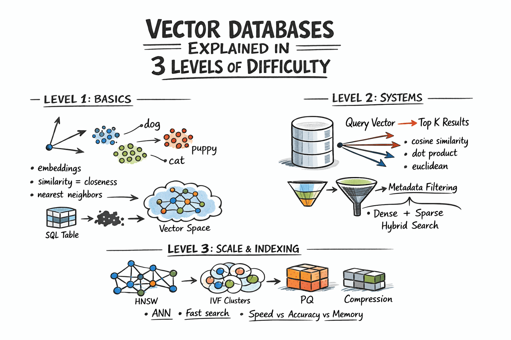

# 📚 Indian Penal Code (IPC) Question-Answering System
An Advanced RAG (Retrieval-Augmented Generation) pipeline built with LangChain and Pinecone to query Indian IPC sections and crime details.
## 💡 What is This Project?
Large Language Models (LLMs) like GPT-4 are powerful, but they have key limitations:
• They are limited to their training cutoff date (e.g., they don't know  events like new sections that added yesterday).
• They lack specialized or private data, such as complete legal codes or internal company HR policies, or private documents.
Retrieval-Augmented Generation (RAG) solves this! By storing legal documents inside Pinecone (a vector database), this system lets an LLM pull real-time, accurate context from the Indian Penal Code before generating an answer.

🚀 Getting Started
Follow these steps to set up and run the project locally using uv.
1. Prerequisites & Installation
If you don't have uv installed, install it using one of the following methods:
####  macOS / Linux
curl -LsSf https://astral.sh/uv/install.sh | sh

####  Windows (PowerShell)
powershell -ExecutionPolicy ByPass -c "irm https://astral.sh/uv/install.ps1 | iex"

#### Or via pip
`pip install uv`

#### Sync environment
`uv sync`

#### How to run the project?
`uv run streamlit run main.py`

#### 🛠️ Key Technologies Used
• LangChain: The framework used to connect the LLM with external data and structure prompt workflows.

• Pinecone: A vector database used to store and quickly search document embeddings.

• OpenAI / OpenRouter: The LLM provider generating precise, grounded answers based only on retrieved text.

• Streamlit: Helps this application with UI interface.


🔍 How It Works
1. Load Data: Indian Penal Code documents (PDFs or CSVs) are loaded into the system. For this project, we are adding IPC_186045.pdf inside assets folder for reference.
2. Chunk & Embed: The text is split into small section chunks and converted into mathematical representations (vector embeddings).
3. Store in Pinecone: Embeddings are indexed in Pinecone for ultra-fast similarity search.
4. Query & Retrieve: When a user asks a question (e.g., "What is the punishment for extortion?"), Pinecone fetches the exact relevant IPC section.
5. Generate Response: LangChain passes the retrieved section into the LLM, which gives a strict, factual answer based strictly on the document.
#### 🧠 LangChain Core Concepts Explained Simply
Concept	Explanation
LLM Wrappers	Interfaces that let python easily communicate with models like OpenAI or OpenRouter.
Prompt Templates	Pre-defined instructions and grounding rules given to the AI to ensure reliable answers.
Vector Store / Indexes	Databases (like Pinecone) that hold and search through your document chunks.
Chains	Workflows that combine components (Prompt + LLM + Vector Search) to perform a task.
Agents	Smart decision-makers that can dynamically call tools or APIs based on user requests.
#### 🚀 Common RAG Use Cases
• Legal AI: Search laws, statutes, or past legal cases.
• Enterprise Search: Query internal company onboarding docs, HR policies, or tech docs.
• Customer Support: Auto-answer customer queries based on product manuals.

Caching - caching is the practice of storing frequently accessed data or results in a temporary, faster storage layer.

Caching optimizes interactions with LLMs by reducing API calls and speeding up applications, resulting in a more efficient user experience.

**InMemoryCache** and **SQLite Caching** are 2 common methods to cache the inputs.
Syntax would be like:
```
from langchain_core.caches import InMemoryCache
from langchain_core.caches import SQLiteCache
set_llm_cache(InMemoryCache())
set_llm_cache(SQLiteCache(database_path=".langchain.db"))
```

Streaming refers to the process of delivering the response in a continuous stream of data instead of sending entire response at once.

#### Prompt templates:
A prompt refers to the input to the model.

Prompt templates are a way to create dynamic prompts for LLMs.

A prompt template takes a piece of text and injects a users input into that piece of text.

In Langchain there are PromptTemplates and ChatPromptTemplates.

use PromptTemplate for managing your prompts with dynamic placeholders. If you are looking for more modern or specialized ways to handle prompts, consider these alternatives depending on your use case:

**ChatPromptTemplate**: If you are working with chat-based models (which is standard for most modern applications), ChatPromptTemplate is the preferred approach. It allows you to structure prompts as a sequence of messages (system, human, ai), providing better control over message roles and context.

**LangChain Hub**: Instead of hardcoding prompt templates in your code, you can use the LangChain Hub to store, version, and manage your prompts. You can pull them programmatically into your application, making them easier to iterate on without changing your source code.
**Runnable Interface**: Ensure you are using the modern LCEL (LangChain Expression Language) syntax by piping your prompt templates into models using the | operator, rather than older chain constructors.

LCEL (LangChain Expression Language) 
```
from langchain_core.prompts import ChatPromptTemplate

# Use ChatPromptTemplate for chat-based models
prompt = ChatPromptTemplate.from_messages([
    ("system", "You are a helpful assistant."),
    ("user", "{input}")
])

# Use the pipe operator (LCEL) to create your chain
chain = prompt | model
```
The **Runnable interface** is a foundational abstraction in LangChain that provides a standardized way to define, compose, and execute components in your LLM applications.

By implementing the Runnable interface, components (like LLMs, prompt templates, retrievers, or custom logic) get access to a consistent set of methods for execution, streaming, and batching. This standard interface is what enables LangChain Expression Language (LCEL) to work, allowing you to easily chain components together using the pipe (|) operator.

Key Features of the Runnable Interface

    **Standard Execution Methods** : Every Runnable component supports core execution methods:
        .invoke(): Execute the component synchronously on a single input.
        .ainvoke(): Asynchronous version of invoke.
        .batch(): Execute the component on a list of inputs in parallel.
        .abatch(): Asynchronous version of batch.
        .stream(): Stream output from the component as it generates.
        .astream(): Asynchronous version of stream.

    **Composition (LCEL)** : The Runnable interface allows you to compose complex pipelines effortlessly. For example, you can pipe a PromptTemplate into an LLM and then into an OutputParser:

    `chain = prompt_template | llm | output_parser`

    Configurable Behavior: You can pass a RunnableConfig (e.g., for tracing, metadata, or execution settings) to these methods to control runtime behavior across your entire chain.

    Extensibility: Most major components in LangChain (LLMs, chat models, prompt templates, retrievers, tools) implement this interface. If you have custom logic you need to integrate, you can easily turn it into a Runnable using decorators like @chain or by inheriting from Runnable.

**Improvements made:**
    1.	Parameters dynamic injection: Pass parameters directly as a dictionary { "context": ..., "input": ... } into chain.stream().
	2.	LangChain Expression Language (LCEL): The expression chain = prompt | model binds prompt formatting and execution into a clean, reusable pipeline.
	3.	No manual SystemMessage / HumanMessage instantiation: ChatPromptTemplate.from_messages automatically builds the appropriate message objects under the hood based on string tuples.

### Langchain tools
Langchain tools are specialized apps for your LLM. They are tiny code modules that allow it to access your information and services. These tools connect your LLM to search engines, databases, API's and many more.

Tools like DuckDuckGo(search the web), Tavily AI, Wikipedia. 

ReAct(Reasoning and Acting) - ReAct is a new approach that combines reasoning(chain-of-thoughts prompting) and acting capabilities of LLM's.

Langchain Agent = Tools + Chains

**What is Langchain hub?**
LangChain Hub is a centralized, community-driven platform for developers to discover, share, and version control prompt templates for Large Language Models (LLMs).

### 🤖 What is a ReAct Agent?

A **ReAct Agent** combines **Reasoning** (thought process) and **Acting** (tool execution) to solve complex tasks dynamically. Instead of generating a direct, static answer, the LLM determines which tool to use based on the user's prompt, processes the tool's result, and decides its next action.

### 🛠️ How It Works (Based on Code & Execution)

1. **Tool Definition:** The agent is configured with access to specialized tools:
   `tools = [python_repl_tool, wikipedia_tool, duckduckgo_tool]`

2. **Dynamic Tool Selection:** Based on the input question, the agent reasons about which tool is best suited:
   * **Math / Code Request:** For *"Generate the first 20 numbers in the Fibonacci series"*, the agent reasons that it should write a Python program and selects **`Action: Python REPL`**.
   
   * **Real-time / Current Info:** For *"Who is the current prime minister of the UK?"*, the agent recognizes it needs live web data and selects **`Action: DuckDuckGo Search`**.
   
   * **Historical / Biographical Info:** For *"Tell me about Napoleon Bonaparte early life"*, the agent chooses **`Action: Wikipedia`**.
   

### Embeddings
Embeddings are the core of building LLMs applications.

Text embeddings are numeric representations of text and are used in NLP and ML tasks.


### Vector Databases:
Vector databases are a new type of database, designed to store and query unstructured data.

Unstructured data is data that does not have a fixed schema, such as text, images and audio.

SQL vs Vector Databases
🗄️ SQL vs. Cloud Vector Databases (Pinecone)
Unlike local embedded stores (such as ChromaDB using SQLite files), Pinecone is a fully managed cloud vector database. It does not store data in local .sqlite files; instead, it hosts high-dimensional vector indexes across distributed cloud servers.
•	SQL Databases (Exact Match): Uses primary keys or indexed columns to return strict values.

`SELECT * FROM legal_code WHERE section_id = 378;`

•	Vector Databases (Semantic Similarity + Metadata Filtering): Converts query text into a math vector and calculates geometric proximity (e.g., Cosine Similarity) to retrieve the top $K$ most semantically similar contexts. It can also combine vector search with metadata filters:

```# Pinecone Vector Search Example
query_vector = embedding_model.embed_query(
    "What is punishment for stealing?"
)

results = index.query(
    vector=query_vector,
    top_k=3,  # Return 3 nearest semantic matches
    filter={"statute": {"$eq": "IPC"}},  # Optional metadata filter
    include_metadata=True,  # Return original text payload
)
```




### 🗄️ Database Querying: SQL vs. Pinecone

| Feature | Traditional SQL Database | Vector Database (Pinecone) |
| :--- | :--- | :--- |
| **Search Mechanism** | Exact Keyword / Key Match | Semantic Similarity (Mathematical Distance) |
| **Storage Engine** | SQL tables / Local `.sqlite` files | Cloud-managed Serverless Vector Index |
| **Example Query** | `SELECT * FROM ipc WHERE section = 378;` | `index.query(vector=query_emb, top_k=3, filter={"statute": "IPC"})` |
| **Output** | Exact row match | Ranked list of nearest contextual matches with metadata |

### Vector Database Pipeline
**Load & Chunk Text** → **Generate Embeddings (Vectors)** → **Store & Index in Database** → **Query via Cosine/Vector Similarity Search**.

Sign up with pinecone.io and create an index in your account. Before that lets understand what are pinecone indexes.

#### Pinecone indexes:
An index is the highest-level organisational unit of vector data in pinecone.

It accepts and stores vectors, serves queries over the vectors it contains and does other vector operations over its contents.

Types of indexes:
Serverless indexes: You dont configure or manage any compute or storage resources(they scale automatically)

Pod based indexes: You choose one or more preconfigured units of hardware(pods).

We created index programatically and established connection with pinecone using `database.py` file.

Pinecone Namespaces: Pinecone allows you to partition the vectors in an index into namespaces.

Queries and other operations are scoped to a specific namesapce, allowing different request to search different subsets of your index.

How this project pipeline works?
1. Prepare the document(Once per document)
    a) Load the data into LangChain Documents.
    b) Split the documents into chunks.
    c) Embed the chunks into numeric vectors.
    d) Save the chunks and the embeddings to a vector database.
2. Search(Once per query)
    a)Embed the user's question.
    b)Using the questions embedding and the chunk embeddings, rank the vectors by similarity to the questions embedding. The nearest vectors represent chunks similar to the question.
3. Ask(Once per query)
    a)Insert the question and the most relevant chunks into a message to a GPT model.
    b) Return GPTs answer.